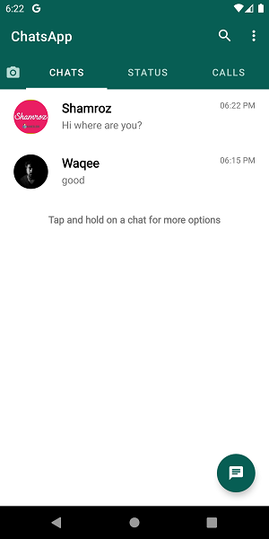
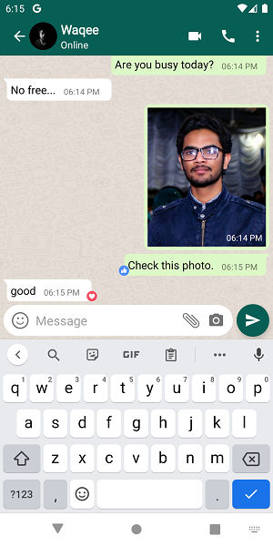
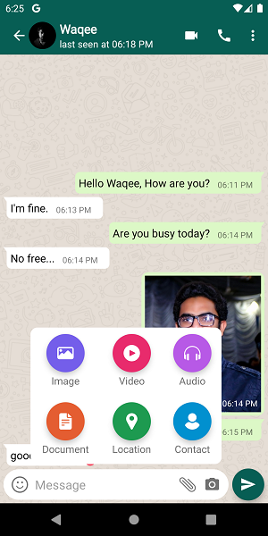
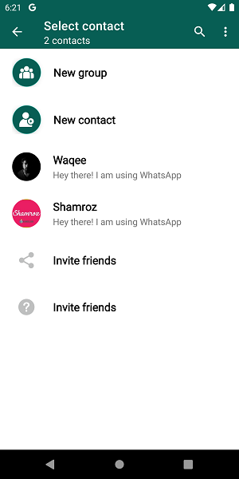
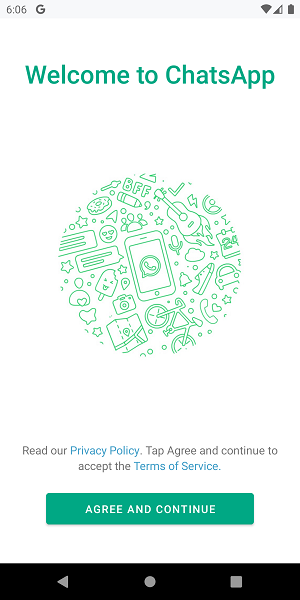
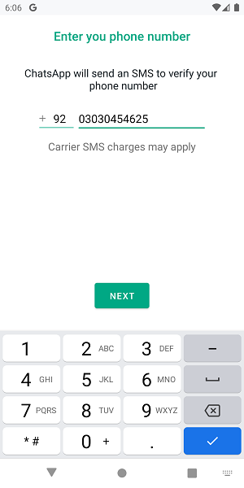
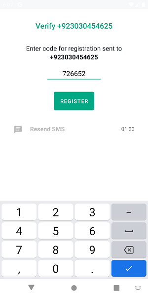
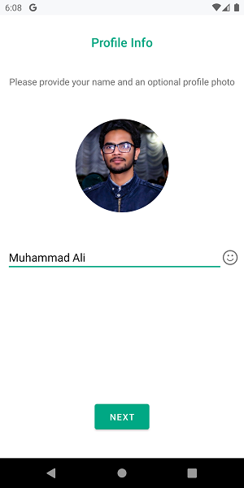

# Chatting-App

Chatting-App to send messages. You can share images/videos upload your status.

Also have reactions e.g like, dislike heart etc.

## What I use
- Firebase Authentication to Login
- Firebase Realtime Database for Realtime Chatting
- Firebase Storage to Store images/videos
- Firebase Cloud Messaging to Send Notifications
- Content Resolver to get Contacts (To get Chatting-App Users)

## Screenshots

